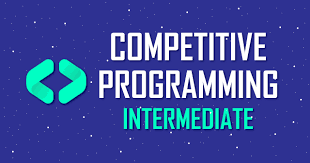
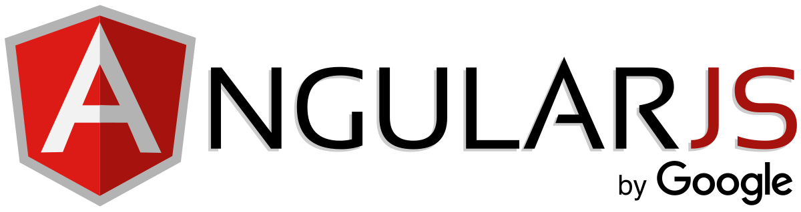

<html>
    <head>
        <meta charset="utf-8">
        <link rel="icon" href="ST.jpg">
        <link rel="stylesheet" href="https://maxcdn.bootstrapcdn.com/bootstrap/4.0.0/css/bootstrap.min.css" integrity="sha384-Gn5384xqQ1aoWXA+058RXPxPg6fy4IWvTNh0E263XmFcJlSAwiGgFAW/dAiS6JXm" crossorigin="anonymous">
        <title></title>
        
    </head>
    <body>
<nav class="navbar navbar-dark bg-success">
  

    <a class="navbar-brand" href="#">Sparsh Techhub</a>
  

</nav>
        

            <ul class="carousel-indicators">
              <li data-target="#demo" data-slide-to="0" class="active"></li>
              <li data-target="#demo" data-slide-to="1"></li>
              <li data-target="#demo" data-slide-to="2"></li>
            </ul>
            

              

                
                
   
                  <h1>Sparsh Techhub</h1>               
                  <a href="https://www.w3schools.com/"><button type="button" class="btn btn-light btn-lg">Tutorials</button></a>
                
   
              

              

                
                
                 
                  <button type="button" class="btn btn-primary btn-lg">Tutorials</button>
                
   
              

              

                
                
 
                  <button type="button" class="btn btn-success btn-lg">Tutorials</button>
                
   
              

            

            <a class="carousel-control-prev" href="#demo" data-slide="prev">
              
            </a>
            <a class="carousel-control-next" href="#demo" data-slide="next">
              
            </a>
          

            
          <main role="main">
            

              

                

                  &nbsp; &nbsp; &nbsp; &nbsp; &nbsp; &nbsp; &nbsp; &nbsp;&nbsp; &nbsp;&nbsp; &nbsp;&nbsp; 
                  <h2>&nbsp; &nbsp; Web Development &nbsp; &nbsp; &nbsp; &nbsp; &nbsp; &nbsp; &nbsp; &nbsp;Tutorials</h2>
                  
Web development refers to the building, creating, and maintaining of websites. It includes aspects such as web design, web publishing, web programming, and database management. It is the creation of an application that works over the internet.

                  
<a class="btn btn-primary" href="https://www.w3schools.com/" role="button">View details &raquo;</a>

                

                

                  &nbsp; &nbsp; &nbsp; &nbsp; &nbsp; &nbsp; &nbsp; &nbsp; &nbsp; &nbsp; &nbsp; 
                  <h2> &nbsp; &nbsp; &nbsp; &nbsp; &nbsp;  Wordpress &nbsp; &nbsp; &nbsp; &nbsp; &nbsp;&nbsp; &nbsp; &nbsp; &nbsp; &nbsp; &nbsp; &nbsp; Tutorials</h2>
                  
WordPress is a free and open-source content management system (CMS) that allows you to host and build websites. WordPress contains plugin architecture and a template system, so you can customize any website to fit your business, blog, portfolio, or online store.

                  
<a class="btn btn-primary" href="https://wordpress.com/create/?utm_source=bing&utm_campaign=bing_wpcom_search_brand_desktop_row_en&utm_medium=paid_search&keyword=wordpress&creative=76759747017204&campaignid=282011434&adgroupid=1228154574804979&matchtype=e&device=c&network=s&targetid=kwd-76759730299059&msclkid=dffbeee4a6ce15de49f88e3a18874b91" role="button">View details &raquo;</a>

                

                

                  &nbsp; &nbsp; &nbsp; &nbsp; &nbsp; &nbsp; &nbsp; &nbsp; &nbsp; &nbsp; &nbsp; &nbsp; 
                  <h2>&nbsp; &nbsp; &nbsp; &nbsp; &nbsp; Competitive Programming Tutorials</h2>
                  
Competitive Programming is a mental sport which enables you to code a given problem under provided constraints. The purpose of this article is to guide every individual possessing a desire to excel in this sport. Like developers show their skills by making different projects.

                  
<a class="btn btn-primary" href="https://www.hackerearth.com/getstarted-competitive-programming/" role="button">View details &raquo;</a>

                

              

                
              
             
              

                

                <h2 class="featurette-heading">React.js</h2>
                  
React. js is an open-source JavaScript library that is used for building user interfaces specifically for single-page applications. It's used for handling the view layer for web and mobile apps. React also allows us to create reusable UI components.

                  <a href="https://reactjs.org/tutorial/tutorial.html"><button type="button" class="btn btn-dark">Start Learning React Now</button></a>
                

                

                  
                

              

              

              

                

                  <h2 class="featurette-heading">AngularJS</h2>
                  
Angular is an application design framework and development platform for creating efficient and sophisticated single-page apps. Angular is written in TypeScript. It implements core and optional functionality as a set of TypeScript libraries that you import into your applications.

                  <a href="https://angular.io/"><button type="button" class="btn btn-dark">Start Learning Angular Now</button></a>             
                

                 
                

                  
                

              
     
              
     
              

                

                  <h2 class="featurette-heading">Bootstrap</h2>
                  
Bootstrap is a free and open-source CSS framework directed at responsive, mobile-first front-end web development. It contains CSS- and JavaScript-based design templates for typography, forms, buttons, navigation, and other interface components.

                  <a href="https://getbootstrap.com/"><button type="button" class="btn btn-dark">Start Learning Bootstrap Now</button></a>
                

                

                  
                

              
      
              
           
            
            
            <footer class="container">
              
<a href="#">Back to top</a>

              
&copy; 2021 SparshCommunity &middot; <a href="#">Privacy</a> &middot; <a href="#">Terms</a>

            </footer>
          </main>
          
    
    
    </body>
</html>
